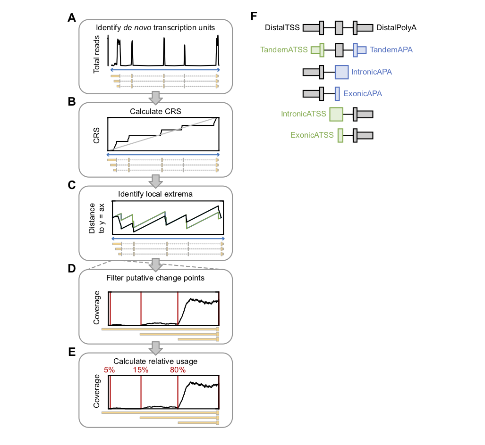

# mountainClimber


**Citation: Cass AA, Xiao X. "The landscape of alternative transcription start and polyadenylation sites in human tissues." JOURNAL, 2019**


mountainClimber is a tool built for identifying alternative transcription start sites (ATS) and alternative polyadenylation sites (APA) from RNA-Seq by finding significant change points in read coverage. It is made up of three main steps, which can be used in isolation:
1. mountainClimberTU: Call transcription units (TUs) de novo from RNA-Seq in each individual sample.
2. mountainClimberCP: Identify change points throughout the entire TU of each individual sample. The premise of this approach is to identify significant change points in the the cumulative read sum (CRS) distribution as a function of position. It identifies the following change point types: DistalTSS, TandemTSS, DistalPolyA, TandemAPA, Junction, Exon, and Intron.
3. mountainClimberRU: Calculate the relative usage of each TSS and poly(A) site in each TU.





### Dependencies
Dependencies include (version used for development indicated in parentheses):
- python (v2.7.2)
- scipy (v0.15.1)
- numpy (v1.10.4)
- peakutils (v1.0.3)
- sklearn (v0.18.1)
- pysam (v0.9.0)
- pybedtools (v0.6.2)
- bisect
- itertools


## Table of contents

[mountainClimber Overview](#mountainclimber-overview)

[Differential ATS and APA](#differential-ats-and-apa)

[Tutorial with test dataset](#tutorial-with-test-dataset)


## mountainClimber Overview
In this overview, we describe the usage of each of the three steps. Below, we provide a tutorial illustrating usage of the pipeline on the test dataset provided. The test data includes bedgraphs and exon junction bed files from MAQC RNA-Seq (chromosome 1) as well as sample output.


### mountainClimberTU
mountainClimberTU calls de novo transcription units. In general, we recommend including introns when calling TUs by explicitly incorporating split reads with argument --junc. However, this is optional. To retrieve junction reads from your bam files, use get_junction_counts.py (described below).
```
usage: mountainClimberTU.py [-h] -b  [-j] [-g] [-c] -s  [-w] [-p] [-n] -o

optional arguments:
  -h, --help           show this help message and exit

Input:
  -b , --bedgraph      Bedgraph file. Can be .gz compressed. (default: None)
  -j , --junc          Junction .bedgraph or .bed file. If file suffix is
                       .bed, will convert to bedgraph. (default: None)
  -g , --genome        Input chromosome sizes. (default: None)

Parameters:
  -c , --minjxncount   Minimum junction read count. (default: 2)
  -s , --strand        Strand of bedgraph file. (default: None)
  -w , --window_size   Window size. (default: 1000)
  -p , --min_percent   Minimum percentage of the window covered. (default:
                       1.0)
  -n , --min_reads     Minimum number of reads per window. (default: 10)

Output:
  -o , --output        Output bed filename. (default: None)
```


### mountainClimberCP
Change point (CP) identification in each sample.
```
usage: mountainClimberCP.py [-h] [-i] [-m] [-g] [-j] [-x] [-a] [-d] [-w] [-t]
                            [-l] [-e] [-s] [-f] [-u] [-n] [-z] [-o] [-p] [-v]

optional arguments:
  -h, --help            show this help message and exit

Input:
  -i , --input_bg       Bedgraph: non-strand-specific or plus strand.
                        (default: None)
  -m , --input_bg_minus
                        Bedgraph, minus strand (strand-specific only).
                        (default: None)
  -g , --input_regions
                        Bed file of transcription units. (default: None)
  -j , --junc           Bed file of junction read counts. (default: None)
  -x , --genome         Genome fasta file. (default: None)

Parameters:
  -a , --peak_thresh    Normalized threshold (float between [0., 1.]). Only
                        the peaks with amplitude higher than the threshold
                        will be detected. -1.0 indicates optimizing between
                        [0.01, 0.05, 0.1] for each TU. (default: -1.0)
  -d , --peak_min_dist
                        Minimum distance between each detected peak. The peak
                        with the highest amplitude is preferred to satisfy
                        this constraint. -1 indicates optimizing between [10,
                        50] for each TU. (default: -1)
  -w , --winsize        Window size for de-noising and increasing precision.
                        -1 indicates optimizing between [50, max(100,
                        gene_length / 100) * 2]. (default: -1)
  -t , --test_thresh    Maximum p-value threshold for KS test and t-test.
                        (default: 0.001)
  -l , --min_length     Minimum gene length for running mountain climber.
                        (default: 1000)
  -e , --min_expn       Minimum expression level (average # reads per bp)
                        (default: 10)
  -s , --min_expn_distal
                        Minimum distal expression level (average # reads per
                        bp). (default: 1)
  -f , --fcthresh       Minimum fold change. (default: 1.5)
  -u , --juncdist       Minimum distance to exon-intron junction. (default:
                        10)
  -n , --minjxncount    Minimum junction read count. (default: 2)
  -z , --max_end_ru     Maximum end relative usage = coverage of end / max
                        segment coverage. (default: 0.01)

Output:
  -o , --output         Output prefix. Bed file of change points has name
                        field = CPlabel:gene:TUstart:TUend:inferred_strand:win
                        size:peak_thresh:peak_min_dist:segment1coverage:segmen
                        t2coverage:segment1sd:segment2sd:exon_coverage. Score
                        = log2(fold change). (default: None)
  -p, --plot            Plot the cumulative read sum (CRS), the distance from
                        CRS to line y=ax, and the coverage with predicted
                        change points. (default: False)
  -v, --verbose         Print progress. (default: False)
```


### mountainClimberRU
Calculate the relative usage of each TSS and poly(A) site in each TU. Run this separately for each condition.
```
usage: mountainClimberRU.py [-h] [-i [[...]]] [-c CONDITION] [-n] [-o OUTPUT]
                            [-v]

optional arguments:
  -h, --help            show this help message and exit

input:
  -i , --input          Bed file of change points. (default: None)

Parameters:
  -n , --min_segments   Minimum number of segments required in the TU to
                        calculate relative end usage. (default: 3)

output:
  -o OUTPUT, --output OUTPUT
                        Output bed filename. Bed name field = CPlabel:gene:TUs
                        tart:TUend:inferred_strand:chromosome:segmentCoverage:
                        CPindex (default: None)
  -v, --verbose         Print progress (default: False)
```


## Differential ATS and APA
While mountainClimber was built for analyzing one single sample, we additionally provide the scripts we built for identifying differential ATS and APA across two conditions given the output of mountainClimberCP. However, if you are analyzing a large number of samples, it may be preferred to run each step separately and parallelized over all samples. Each step of is described below.


### diff_cluster
Cluster change points first across replicates within each condition, and then across conditions.
```
usage: diff_cluster.py [-h] [-i [[...]]] [-c [[...]]] [-n [[...]]] [-e]
                     [-f] [-d] [-m] [-l] [-s] [-o] [-v]

optional arguments:
  -h, --help            show this help message and exit

Input:
  -i [ [ ...]], --input [ [ ...]]
                        List of space-delimited change point files. (default:
                        None)
  -c [ [ ...]], --conditions [ [ ...]]
                        List of space-delimited condition labels for each
                        --input file. (default: None)

Parameters:
  -n [ [ ...]], --minpts [ [ ...]]
                        List of space-delimited DBSCAN minPts values. These
                        indicate the minimum # points for DBSCAN to consider a
                        core point. The minimum of this list will be used to
                        cluster across conditions. (default: None)
  -e , --eps            Maximum distance between 2 points in a neighborhood.
                        -1.0 indicates using the minimum optimal window size
                        from mountain climber. (default: -1.0)
  -f , --min_fc         Minimum fold change for change points. (default: -1.0)
  -d , --min_conditions
                        Minimum number of conditions for a gene to be
                        clustered across conditions. (default: 1)
  -m , --min_expn       Minimum expression in exons for a gene to be
                        clustered. (default: 0)
  -l, --lm_flag         Input are results from diff_cluster. (default: False)
  -s, --ss_flag         Flag: RNA-Seq is strand-specific. (default: False)

output:
  -o , --output         Output file of clustered segments. name field = CPlabe
                        l:condition:gene:TUstart:TUend:inferred_strand:winsize
                        :min_point_clustered:max_point_clustered:cluster_stdev
                        :n_points_clustered. (default: None)
  -v, --verbose         Print progress details. (default: False)
```


### diff_segmentReadCounts
Calculate the average reads/bp for each segment after clustering.
```
usage: diff_segmentReadCounts.py [-h] [-i] [-p] [-m] [-c] [-s] [-o]

optional arguments:
  -h, --help         show this help message and exit

Input:
  -i , --segments       _segments.bed from clusterCPs (default: None)
  -p [ [ ...]], --bgplus [ [ ...]]
                        List of space-delimited bedgraphs: non-strand-specific
                        or plus strand. (default: None)
  -m [ [ ...]], --bgminus [ [ ...]]
                        List of space-delimited bedgraphs: minus strand.
                        (default: None)
  -c [ [ ...]], --conditions [ [ ...]]
                        List of space-delimited condition labels for each
                        --bgplus file (default: None)

Output:
  -o , --output         Output prefix. (default: None)
```


### diff_ru
Calculate the relative usage of each 5' and 3' segment
```
usage: diff_ru.py [-h] [-i [[...]]] [-s] [-c] [-l] [-n] [-o] [-v]

Calculate the relative usage of each 5' and 3' segment

optional arguments:
  -h, --help            show this help message and exit

Input:
  -i [ [ ...]], --input [ [ ...]]
                        List of space-delimited output files from
                        diff_segmentReadCounts for a single condition.
                        (default: None)
  -s , --segments       Condition-specific _segments.bed output file from
                        diff_cluster. (default: None)
  -c , --condition      Condition label (default: None)
  -l , --input_cp       Condition-specific _cluster.bed output file from
                        diff_cluster. (default: None)

Parameters:
  -n , --min_segments   Minimum number of segments required in the TU to
                        calculate relative end usage (default: 3)

Output:
  -o , --output         Output prefix. (default: None)
  -v, --verbose         Print progress. (default: False)
```


### diff_test
Test for differential ATS and APA sites between two conditions.
```
usage: diff_test.py [-h] [-i [[...]]] [-r [[...]]] [-ci [[...]]]
                  [-cr [[...]]] [-d] [-p] [-t] [-m] [-o] [-v]

optional arguments:
  -h, --help            show this help message and exit

Input:
  -i [ [ ...]], --input [ [ ...]]
                        List of space-delimited output files from
                        diff_segmentReadCounts for two conditions. (default:
                        None)
  -r [ [ ...]], --ru_segments [ [ ...]]
                        List of space-delimited _ru_segments output files from
                        diff_ru, one for each condition (default: None)
  -ci [ [ ...]], --conditions_input [ [ ...]]
                        List of space-delimited condition labels for each
                        --input file. (default: None)
  -cr [ [ ...]], --conditions_ru_segments [ [ ...]]
                        List of space-delimited condition labels for each
                        --ru_segments file. (default: None)

Parameters:
  -d , --min_dstlCov    Minimum average reads per bp in distal segment across
                        samples in at least 1 condition (default: 5.0)
  -p , --min_prxlCov    Minimum average reads per bp in proximal segment
                        across samples in all conditions (default: 0.0)
  -t , --pmax           Maximum p-value. (default: 0.05)
  -m , --dtop_abs_dif_min
                        Minimum relative usage (RU) difference. (default:
                        0.05)

Output:
  -o , --output         Output prefix. 3 output files: (1) bed file of all
                        tested change points, (2) bed file of differential
                        change points, (3) summary of total differential
                        change points. Bed name field = CPlabel;testType;CPind
                        ex;gene:TUstart:TUend:proximalSegment:distalSegment:RU
                        difference:RUconditionA:RUconditionB:pBH (default:
                        None)
  -k, --keep            Keep intermediate output files. (default: False)
  -v, --verbose         Print progress. (default: False)
```


## Tutorial with test dataset
Because RNA-Seq reads are aligned to the genome, and we include introns when calling change points, we recommend carefully dealing with multi-mapped reads. Below we describe our recommended alignment pipeline, which involves genome alignment and RSEM. We include examples for both hisat2 and STAR.


### 1. Genome alignment
Align to the genome allowing 100 or 200 multi-mapped reads. Because mountainClimberTU calls entire transcription units including introns, and introns contain repetitive sequences, it is recommended to allow a generous number of multi-mapped reads followed by RSEM later to assign the most probable mapping location. For example, use -k 100 or 200 for hisat2 and --outFilterMultimapNmax 100 or 200 with STAR.

hisat2:
```
hisat2 --dta-cufflinks --no-softclip --no-mixed --no-discordant -k 100
```
STAR: with ENCODE parameters
```
STAR --outSAMunmapped Within --outFilterType BySJout --outSAMattributes NH HI AS NM MD --outFilterMultimapNmax 200 --outFilterMismatchNmax 999 --outFilterMismatchNoverLmax 0.04 --alignIntronMin 20 --alignIntronMax 1000000 --alignMatesGapMax 1000000 --alignSJoverhangMin 8 --alignSJDBoverhangMin 1 --sjdbScore 1 --runThreadN 8 --genomeLoad NoSharedMemory --outSAMtype BAM Unsorted --outSAMheaderHD @HD VN:1.4 SO:unsorted
```


### 2. Create mountainClimber input files


#### Get junction reads
Identify split reads from a bam file and report the total counts per intron.
```
usage: get_junction_counts.py [-h] -i  -s  [-e] [-m] [-a] -o

optional arguments:
  -h, --help          show this help message and exit

Input:
  -i , --input_bam    Bam file (default: None)
  -s , --strand       Strandedness. Options: fr-firststrand, fr-secondstrand,
                      fr-unstrand, single (default: fr-firststrand)

Parameters:
  -e , --overhang     Minimum number of base pairs in each exon (default: 8)
  -m , --min_intron   Minimum intron length (default: 30)
  -a , --max_intron   Maximum intron length (default: 500000)

Output:
  -o , --output       Output filename (default: None)
```

Example usage:
```
python get_junction_counts.py -i SRR950078.bam -s fr-unstrand -o ./junctions/SRR950078_jxn.bed
```


#### Generate bedgraphs
Create bedgraphs using bedtools for input to mountainClimberTU. For example:
```
bedtools genomecov -trackline -bg -split -ibam SRR950078.bam -g hg19.chr1.genome > ./bedgraph/SRR950078.bedgraph
```


### 3. mountainClimberTU
Example usage:
```
python mountainClimberTU.py -b ./bedgraph/SRR950078.bedgraph -j ./junctions/SRR950078_jxn.bed -s 0 -g hg19.chr1.genome -o mountainClimberTU/SRR950078_tu.bed
```

After identifying transcription units in each sample, merge all sample TUs and annotate them:
```
usage: merge_tus.py [-h] -i [INFILES [INFILES ...]] -g REFGTF -s {y,n} -o
                    OUTPUT

optional arguments:
  -h, --help            show this help message and exit
  -i [INFILES [INFILES ...]], --infiles [INFILES [INFILES ...]]
                        Input TU bed files from mountainClimberTU output, space-
                        delimited (default: None)
  -g REFGTF, --refgtf REFGTF
                        Reference gtf file (default: None)
  -s {y,n}, --ss {y,n}  strand specific? (y or no) (default: None)
  -o OUTPUT, --output OUTPUT
                        Output prefix (default: None)
```

Example usage:
```
python merge_tus.py -i ./mountainClimberTU/*_tu.bed -s n -g gencode.v25lift37.annotation.chr1.gtf -o tus_merged
```

### 4. RSEM


#### Prepare reference
RSEM requires transcriptome alignments rather than genome alignments. So, we first create a reference using a combination of annotation file and de novo TUs from mountainClimberTU:
```
rsem-prepare-reference -p 8 --gtf tus_merged.annot.gencode.v25lift37.annotation.gtf --star hg19.fa rsem_ref
```


#### Transcriptome alignment
Next, re-align the reads but this time to the transcriptome. Because RSEM cannot handle indels, we force hisat2 to ignore them (STAR avoids indels by default). Again, we allow at least 100 alignments per read so that RSEM will decide their best alignment as opposed to the aligner.

hisat2:
```
hisat2 --mp 6,4 --no-softclip --no-unal --no-mixed --no-discordant --no-spliced-alignment --end-to-end --rdg 100000,100000 --rfg 100000,100000 -k 100
```
STAR:
```
STAR --genomeDir ref --outFilterType BySJout --outSAMattributes NH HI AS NM MD --outFilterMultimapNmax 200 --outFilterMismatchNmax 999 --outFilterMismatchNoverLmax 0.04 --alignIntronMin 20 --alignIntronMax 1000000 --alignMatesGapMax 1000000 --alignSJoverhangMin 8 --alignSJDBoverhangMin 1 --sjdbScore 1 --runThreadN 8 --genomeLoad NoSharedMemory --outSAMtype BAM Unsorted --quantMode TranscriptomeSAM --outSAMheaderHD @HD VN:1.4 SO:unsorted
```


#### Calculate expression
Next, run rsem-calculate expression to assign multi-mapped read locations. For example:
```
rsem-calculate-expression -p 8 --paired-end --append-names --seed 0 --estimate-rspd --sampling-for-bam --output-genome-bam --alignments SRR950078.toTranscriptome.out.bam rsem_ref SRR950078_rsem
```

Finally, we retain only the alignments with maximum posterior probability for each read, designated by "ZW:f:1" and generate a bedgraph for transcriptome alignments using bedtools, as described above.


### 5. mountainClimberCP
Call change points in each sample. Example usage:
```
python mountainClimberCP.py -i ./bedgraph/SRR950078.bedgraph -g tus_merged.annot.gencode.v25lift37.annotation.singleGenes.bed -j ./junctions/SRR950078_jxn.bed -o mountainClimberCP/SRR950078.bed -x hg19.chr1.fa
```


### 6. mountainClimberRU or differential ATS & APA
After mountainClimberCP, use mountainClimberRU to calculate relative usage for a single sample, or use the provided scripts to analyze differential ATS & APA.

#### mountainClimberRU
Calculate the relative usage of each TSS and poly(A) site in each TU.
```
python mountainClimberRU.py -i mountainClimberCP/SRR950078.bed -o mountainClimberRU/SRR950078.bed
```

#### Differential ATS and APA
Call differential ATS and APA. Example usage:

First, cluster change points:
```
python diff_cluster.py -i ./mountainClimberCP/*bed -c uhr brain uhr brain uhr brain uhr brain uhr brain -n 4 4 4 4 4 4 4 4 4 4 -o diff/diff
```

Second, calculate the average read counts per bp in each segment in each sample:
```
python diff_segmentReadCounts.py -i ./diff/diff_segments.bed -p ./bedgraph/SRR950078.bedgraph -c uhr -o ./diff/diff
```

Third, calculate the relative usage of each segment in each condition:
```
python diff_ru.py -i ./diff/*uhr*read* -s diff/diff_segments.bed -c uhr -l diff/diff_cp_uhr.bed -o diff/diff
python diff_ru.py -i ./landMarker/*brain*read* -s diff/diff_segments.bed -c brain -l diff/diff_cp_brain.bed -o diff/diff
```

Finally, test for differential ATS and APA
```
python diff_test.py -i ./diff/*Counts.bed -r ./diff/diff_ru_segments_brain.bed ./diff/diff_ru_segments_uhr.bed -ci uhr brain uhr brain uhr brain uhr brain uhr brain -cr brain uhr -o ./diff/diff_maqc_d5_m0.05 -d 5 -m 0.05
```
